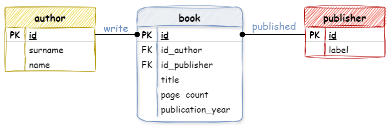

# Библиотека


Проект создаем со сборщиком Maven (в связи с тем, что в Университете не доступен сборщик gradle)

## Чтобы развернуть резервную копию базы данных:
1) Резервная копия базы данных приложена в resources/backup.sql
2) Подключитесь к локальному серверу PostgreSQL через PgAdmin (или терминал)
3) Создайте пустую базу данных rut_library
4) Восстановите в ней приложенную резервную копию базы данных

## Чтобы подключить JDBC-драйвер к проекту:
1) Через подключение библиотеки к проекту:
* File -> Project Structure -> Libraries
* На плюсе (+) выберите From Maven...
* В поиске найдите (search) драйвер, соответствующий вашей базе данных: org.postgresql:postgresql:42.6.0 [или старшая версия]
* И подтвердите подключение - ОК -> Apply

2) Или через файл-сборки:
* добавьте в файле-сборки pom.xml в список зависимостей:
```
<dependencies>
    <dependency>
        <groupId>org.postgresql</groupId>
        <artifactId>postgresql</artifactId>
        <version>42.7.3</version>
    </dependency>
</dependencies>
```
* И подтвердить загрузку библиотеки

## Чтобы осуществить запрос к базе данных необходимо:
1) Открыть соединение с базой данных - {@link java.sql.Connection}
2) Определить оператор для SQL-запроса - {@link java.sql.Statement} или его дочерние классы {@link java.sql.PreparedStatement}. При необходимости, вложить данные в SQL-запрос
3) Выполнить SQL-запрос и в зависимости от типа проанализировать результат:
    + Простой запрос - executeQuery - результат запроса {@link java.sql.ResultSet}
    + Запрос на изменение - executeUpdate - результат запроса представляет собой количество измененных строк (также можно затребовать возвращаемые данные и считать из через {@link java.sql.ResultSet})
